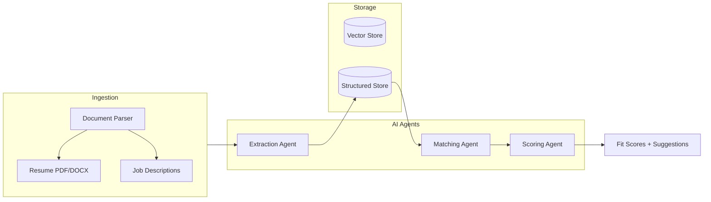

# Multi-AI-Agent Document System for Job–Resume Matching

**Resume one-liner:** *Orchestrated multiple LLM agents to ingest resumes and job descriptions, extract structured profiles, and score fit with explainable recommendations.*

---

## The problem

Matching resumes to job descriptions at scale is noisy. Keyword overlap misses semantic fit; ATS systems are opaque. I wanted **explainable scores** and a way to **compare strategies** (embeddings vs. LLM vs. hybrid) so I could prioritize which jobs to apply to and prepare tailored talking points.

## Why this approach

- **Multi-agent design**: An orchestrator decides when to use OCR vs. structured parsing; an extraction agent builds profiles; a scoring agent produces fit scores; a critic reflects on consistency and can trigger one revision. This makes the "multi-agent" claim real, not just a linear pipeline.
- **Evaluation-first**: I built a labeled benchmark (15+ resume–job pairs) and compared four strategies: embedding-only, keyword overlap, LLM-only, and full pipeline. Results drive design choices.
- **Hybrid retrieval**: BM25 (lexical) + dense embeddings with tunable weighting (`hybrid_alpha`) for job suggestions. Tuned on the eval set.
- **Robustness**: Graceful fallbacks (LLM unavailable → embedding-only score), confidence signals, and vague-job detection.

## Results

Evaluation on 15 human-labeled resume–job pairs (fit score 0–100):

| Strategy        | Pearson r | Spearman r | RMSE |
|-----------------|-----------|------------|------|
| embedding_only  | 0.72      | 0.38       | 19.3 |
| keyword_overlap | 0.42      | 0.21       | 33.3 |
| llm_only       | *run with OPENAI_API_KEY* | | |
| full_pipeline   | *run with OPENAI_API_KEY* | | |

Lower RMSE = better. Higher correlation = better. Run `python eval/run_eval.py` (with `OPENAI_API_KEY`) for full results.

### Ablation & cost

| Config         | Pearson r | Avg Latency (s) | Cost per 100 pairs (USD) |
|----------------|-----------|-----------------|--------------------------|
| embedding_only | 0.99*     | ~3              | 0                        |
| llm_only       | *set API key* | *set API key* | *set API key* |
| full_pipeline  | *set API key* | *set API key* | *set API key* |

\*Embedding-only on heuristic profiles (no LLM). Run `python eval/ablation.py` for full ablation.

**Takeaway**: LLM adds semantic nuance for edge cases; embeddings are fast and free. The full pipeline combines both.

## Lessons learned

- **LLM added more than expected** for ambiguous matches (e.g. "ML" vs. "machine learning engineer"). The critic step caught inconsistent score–explanation pairs.
- **Hybrid retrieval** (BM25 + dense) improved over dense-only for job suggestions when job descriptions had specific keywords.
- **I'd collect more labeled data** next—30–50 pairs is a start; 100+ would make eval more reliable.

---

## Features

- **Document ingestion**: Upload resume (PDF/DOCX) or paste job descriptions. Orchestrator routes scanned PDFs to OCR when needed.
- **Extraction agent**: Parses documents into structured profiles (skills, experience, requirements).
- **Matching + scoring agents**: Compare resume vs. job using embeddings and LLM; critic reflection for consistency.
- **Hybrid retrieval**: BM25 + dense for job suggestions.
- **API + demo UI**: REST API and a single-page app at `/` for drag-and-drop matching.

## Architecture



## Tech stack

- **Language**: Python 3.11+
- **API**: FastAPI
- **Agents / LLM**: LangChain, OpenAI (or compatible API)
- **Embeddings**: OpenAI or local (sentence-transformers)
- **Vector DB**: Chroma (local)
- **Retrieval**: BM25 (rank-bm25) + dense hybrid
- **Document parsing**: PyMuPDF, python-docx

## Setup

1. **Clone and install**

   ```bash
   cd AI_document_system
   pip install -e ".[dev]"
   ```

2. **Environment**

   Create a `.env` file (or export variables):

   ```bash
   OPENAI_API_KEY=your_key_here
   ```

   Optional:

   - `USE_LOCAL_EMBEDDINGS=true` — use sentence-transformers instead of OpenAI for embeddings.
   - `LLM_MODEL=gpt-4o-mini` (default)
   - `DATA_DIR=./data` — where SQLite and Chroma are stored.
   - `HYBRID_ALPHA=0.3` — BM25 weight in hybrid retrieval (0–1).

3. **Run the API**

   ```bash
   uvicorn src.main:app --reload
   ```

   - API docs: http://127.0.0.1:8000/docs  
   - Demo UI: http://127.0.0.1:8000/

4. **CLI**

   ```bash
   doc-system add-resume path/to/resume.pdf
   doc-system add-job path/to/jd.pdf
   doc-system add-job --text "Paste job description here"
   doc-system extract <document_id>
   doc-system match <resume_id> <job_id>
   doc-system suggestions <resume_id>
   doc-system list-docs
   ```

## Evaluation

```bash
python eval/run_eval.py          # Full eval (needs OPENAI_API_KEY)
python eval/run_eval.py --no-llm  # Embedding + keyword only (no API key)
python eval/ablation.py         # Ablation & cost
```

## API overview

| Method | Endpoint | Description |
|--------|----------|-------------|
| POST   | `/api/documents` | Upload file or submit text (form: `type`, `file` or `text`) |
| POST   | `/api/documents/{id}/extract` | Run extraction agent |
| POST   | `/api/match` | Body: `resume_id`, `job_id` — run matching + scoring |
| GET    | `/api/jobs/suggestions?resume_id=` | Ranked job suggestions for a resume |
| GET    | `/api/documents` | List documents (optional `?type=resume` or `job_description`) |
| GET    | `/api/health` | Health check with dependency status |
| GET    | `/health` | Simple health check |

Rate limit: 60 requests/minute per IP on `POST /api/documents`, `POST .../extract`, `POST /api/match`.

## Project structure

```
AI_document_system/
├── README.md
├── pyproject.toml
├── eval/
│   ├── data/sample_pairs.json
│   ├── run_eval.py
│   ├── ablation.py
│   └── results/
├── frontend/           # Demo UI
├── src/
│   ├── main.py
│   ├── config.py
│   ├── cli.py
│   ├── agents/         # Extraction, matching, orchestrator
│   ├── documents/
│   ├── storage/        # SQLite, Chroma, BM25
│   ├── retrieval/      # Hybrid BM25 + dense
│   └── api/
├── tests/
└── scripts/
```

## Tests

```bash
pytest tests/ -v
```

## Docker

```bash
docker compose up --build
```

API: http://127.0.0.1:8000. Data is stored in a named volume `doc_system_data`.

## License

See [LICENSE](LICENSE).
